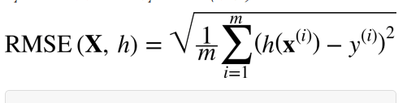
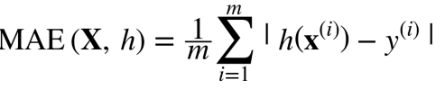

# end to end project

- Look at the big picture
- Get the data
- Discover and visualize the data to gain insights
- Prepare the data for Machine Learning algorithms
- Select a model and train it
- Fine-tune your model
- Present your solution
- Launch, monitor and maintain your system

## Frame the Problem

- Understand what the solution is trying to do
- Understand what solution already exists and its shortcoming
- It is unsupervised, unsupervised or Reinforcement learning ?Is it a classification task, a regression task, or something else? Should you use batch learning or online learning techniques? Before you read on, pause and try to answer these questions for yourself.

## Select a Performance Measure

Your next step is to select a performance measure. A typical performance measure for regression problems is the Root Mean Square Error(RMSE).It gives an idea of how much error the system typically makes in its predictions, with a higher weight for large errors.

- _m_ is the number of instances in the dataset you are measuring the RMSE on
- _`x^(i)`_ is a vector of all the feature value (excluding the label) of the i^th instance of the dataset, and y^(i) is its label
- **X** - is a matric containing all the feature values (excluding labels) of all instances in the dataset.
- _h_ is your system's prediction function, also called a hypothesis.
- RMSE( X, h) is the cost function measured on the set of examples using your hypothesis h.

We use lowercase italic font for scalar values (such as _m_ or _y( i)_) and function names (such as _h_), lowercase bold font for vectors (such as **x( i)**), and uppercase bold font for matrices (such as **X**).

Even though the RMSE is generally the preferred perfoemance measure for regression tasks, in some contextxs you may prefer to use another fucntion e.g the Mean Absolut error

Both the RMSE and the MAE are ways to measure the distance between two vectors: the vector of predictions and the vector of target values. Various distance measures, or norms, are possible: Computing the root of a sum of squares (RMSE) corresponds to the Euclidean norm: this is the notion of distance you are familiar with. It is also called the ℓ2 norm, noted ∥ · ∥ 2 (or just ∥ · ∥). Computing the sum of absolutes (MAE) corresponds to the ℓ1 norm, noted ∥ · ∥ 1. This is sometimes called the Manhattan norm because it measures the distance between two points in a city if you can only travel along orthogonal city blocks. More generally, the ℓk norm of a vector v containing n elements is defined as ∥ v ∥ k = (| v0 | k + | v1 | k + ... + | vn | k) 1/ k. ℓ0 gives the number of nonzero elements in the vector, and ℓ ∞ gives the maximum absolute value in the vector. The higher the norm index, the more it focuses on large values and neglects small ones. This is why the RMSE is more sensitive to outliers than the MAE. But when outliers are exponentially rare (like in a bell-shaped curve), the RMSE performs very well and is generally preferred.

## Check the Assumptions

It is good practice to list and verify the assumptions that have been made so far; this can help you catch serious issues early on.
